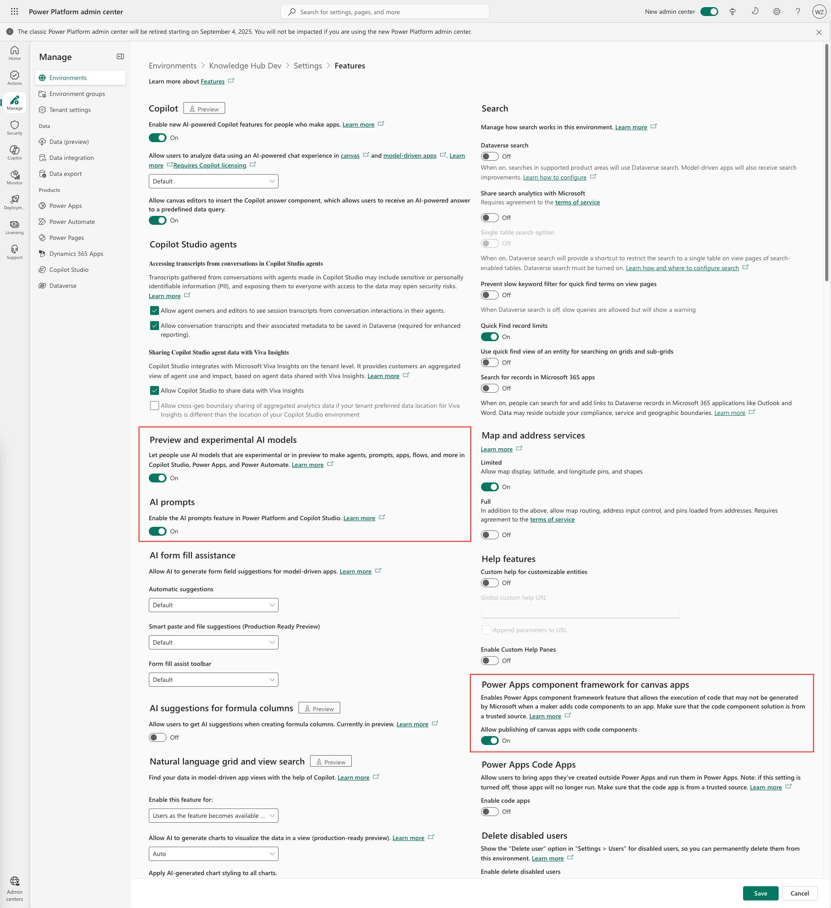

# Deployment Guide
## Prerequisites

### License/Products Required

| Name | Purpose | Must Have | Suggest Quantity |
|--------------|---------|-----------|-----------------|
| Power Apps Premium | For IT admin, developer and knowledge manager | Yes | 3+, by demand |
| Power Pages | Web portal interface | Optional | 1 |
| Power Automate Process | For backend automation flow instances | Yes | 5 |
| AI Builder Credits | For knowledge building process | Yes | 1+, by demand |
| Copilot Studio Messages | For orchestration and knowledge Q&A | Yes | 2+, by demand |
| Azure Function | To host the file processing code | Yes | by consumption |
| Azure Blob Storage | To store the file and images | Yes | by consumption |
| Microsoft SharePoint site | For multiple file type convention support | Yes | 1 |

### Permissions Required
- Power Platform admin or D365 admin
- Azure Application Admin
- Power Platform Admin role
  - Be able to create environment and Power Pages website
- Able to create Azure service resources

## Deployment
### Azure Setup
1. Activate Azure Services (Optional, must enable for document multi-modal recognition)
   1. Azure Blob Storage
   2. Azure Function

> **Why Optional?** 
If you don't have Azure resource or hard to activate it in some reason, such like internal process. You can use KB Hub Document Processing Tool to process document local and upload to cloud Dataverse

2. Create environment
- **Development Environment**
   - Region: US or Europe (based on developer location)
   - Language: English
   - Type: Developer/Sandbox

- **Testing/QA Environment**
   - Region: Same as target production region
   - Language: English
   - Type: Sandbox

- **Production Environment**
   - Region: US or region closest to most users
   - Language: English
   - Type: Production
3. Environment settings
   - Enable PCF
   - Enable AI Builder preview features
   
   - Email attachment size set to 131,072kb
   
   - Enable your desired lanugage(for UI only, doesn't affect knowledge query quality)
   
  
4. Create Power Page FAQ website (~10 min)
- Creat from FAQ template

- Name it and choose your prefered lanugage(Additioanl language must enabled in Power Platform Admin Center before create website.)

1. Import solutions
   1. [Creator Kit](https://learn.microsoft.com/en-us/power-platform/guidance/creator-kit/setup) ([Github](https://github.com/microsoft/powercat-creator-kit))
      1. CreatorKitCore
      2. CreatorKitAI
      
   2. [PCF-Universal-Textbox-Fluent](https://github.com/illusion615/PCF-Universal-Textbox-Fluent/releases)
   
   3. Power Platform AI Base
   4. Knowledge Hub Solution
